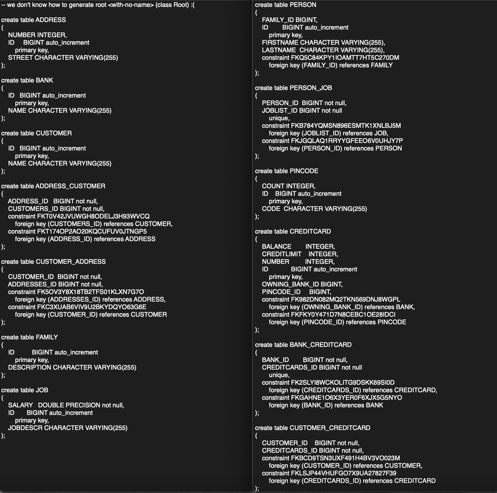

### REPORT

# Assignment 4 #

It seems the Hibernate autodetection does not work as intended with the database. 
Because I had to include the classes with entities manually in the persistence.xml file. I also had some problems with
the CreditCardTest, and had to change two of the list compare tests to compare the contents of the list instead of the actual list objects. 
It seemed I was not the only one that ran into the two problems above, but after making the changes I mentioned above, all test cases passed. 

The database tables where inspected by using an internal Intellij tool to read the db file and parse it into readable tables. They looked like this upon inspection:

